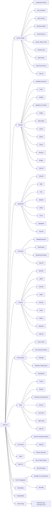

# allrecipes

## Sitemap

```mermaid
graph LR
    Home["Home (/)"] --> DT["Dinner Tonight"]
    Home --> REC["Recipes"]
    Home --> ING["Ingredients"]
    Home --> OCC["Occasions"]
    Home --> CUI["Cuisines"]
    Home --> KIT["In the Kitchen"]
    Home --> NEWS["News"]
    Home --> COM["Community"]
    Home --> VID["Video"]
    Home --> ABT["About Us"]
    Home --> MAG["Get The Magazine"]
    Home --> NL["Newsletters"]
    Home --> SWP["Sweepstakes"]
    Home --> APP["Get The App"]

    %% Dinner Tonight

    DT --> DT1["5-Ingredient Dinners"]
    DT --> DT2["One-Pot Meals"]
    DT --> DT3["Quick & Easy"]
    DT --> DT4["30-Minute Meals"]
    DT --> DT5["Family Dinners"]
    DT --> DT6["Soups, Stews & Chili"]
    DT --> DT7["Comfort Food"]
    DT --> DT8["Main Dishes"]
    DT --> DT9["Sheet Pan Dinners"]
    DT --> DT10["View All"]

    %% Recipes
    REC --> REC1["Breakfast & Brunch"]
    REC --> REC2["Lunch"]
    REC --> REC3["Healthy"]
    REC --> REC4["Appetizers & Snacks"]
    REC --> REC5["Salads"]
    REC --> REC6["Side Dishes"]
    REC --> REC7["Soups"]
    REC --> REC8["Bread"]
    REC --> REC9["Drinks"]
    REC --> REC10["Desserts"]
    REC --> REC11["Budget"]
    REC --> REC12["View All"]

    %% Ingredients
    ING --> ING1["Chicken"]
    ING --> ING2["Beef"]
    ING --> ING3["Pork"]
    ING --> ING4["Seafood"]
    ING --> ING5["Pasta"]
    ING --> ING6["Fruits"]
    ING --> ING7["Vegetables"]
    ING --> ING8["View All"]

    %% Occasions
    OCC --> OCC1["Tailgating Recipes"]
    OCC --> OCC2["Fall Recipes"]
    OCC --> OCC3["Oktoberfest Recipes"]
    OCC --> OCC4["View All"]

    %% Cuisines

    CUI --> CUI1["Mexican"]
    CUI --> CUI2["Italian"]
    CUI --> CUI3["Chinese"]
    CUI --> CUI4["Indian"]
    CUI --> CUI5["German"]
    CUI --> CUI6["Greek"]
    CUI --> CUI7["Filipino"]
    CUI --> CUI8["Japanese"]
    CUI --> CUI9["View All"]

    %% In the Kitchen
    KIT --> KIT1["Tips & Tricks"]
    KIT --> KIT2["Our Favorite Products"]
    KIT --> KIT3["Cleaning"]
    KIT --> KIT4["Storage & Organization"]
    KIT --> KIT5["Entertaining"]

    %% News

    NEWS --> NEWS1["Trends"]
    NEWS --> NEWS2["Recalls"]
    NEWS --> NEWS3["Celebrity & Entertainment"]
    NEWS --> NEWS4["Grocery"]
    NEWS --> NEWS5["Fast Food"]
    NEWS --> NEWS6["Taste Tests"]
    NEWS --> NEWS7["View All"]

    %% Community

    COM --> COM1["Meet the Allrecipes Allstars"]
    COM --> COM2["Features"]
    COM --> COM3["Recipe Inspiration"]

    %% About Us

    ABT --> ABT1["How to Add a Recipe"]
    ABT --> ABT2["About Allrecipes"]

    %% Get The Magazine
    MAG --> MAG1["Manage Your Subscription"]
    MAG --> MAG2["Get Help"]

    %% Get The App
    APP --> APP1["MyRecipes app (myrecipes.com)"]

```