# Midterm Proposal

## Concept/Theme

### Anti-inspiration:
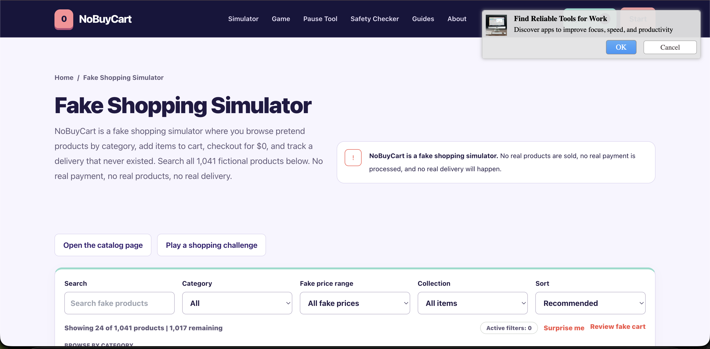
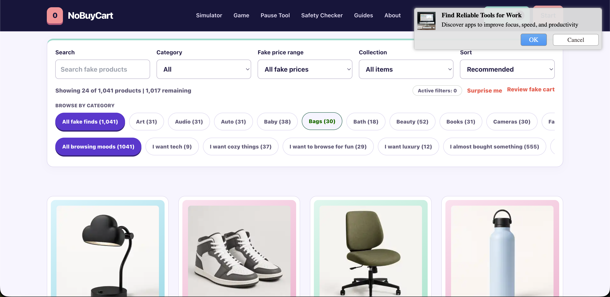
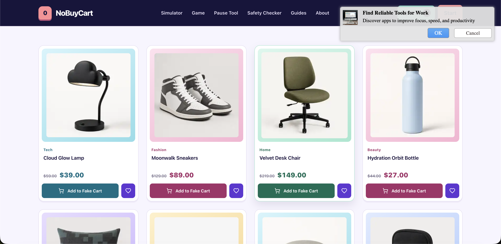

### Concept:

Even though I don't often shop online, I love the idea of fake shopping sites to simulate the dopamine rush of
retail therapy!  It reminded me of the joke website "Download More RAM" which is an example of a joke website
done well.  However, my website will feature clothing products instead.

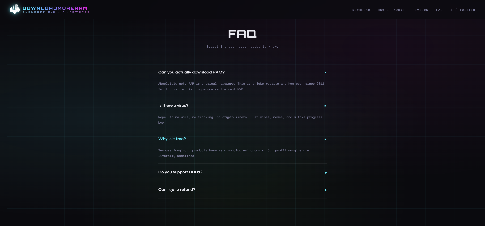

### Inspiration: 

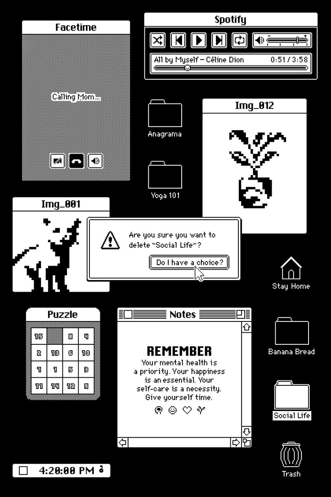
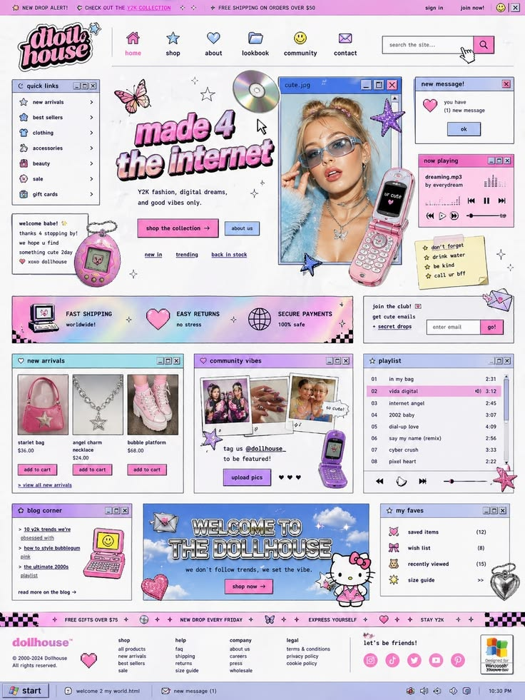
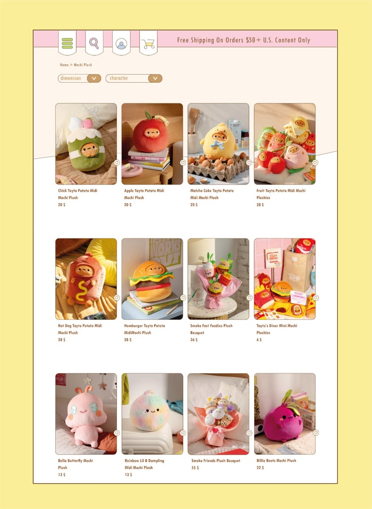

## Existing websites

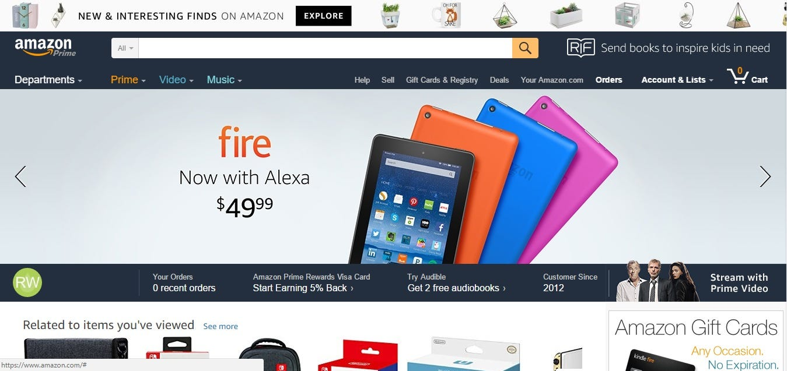
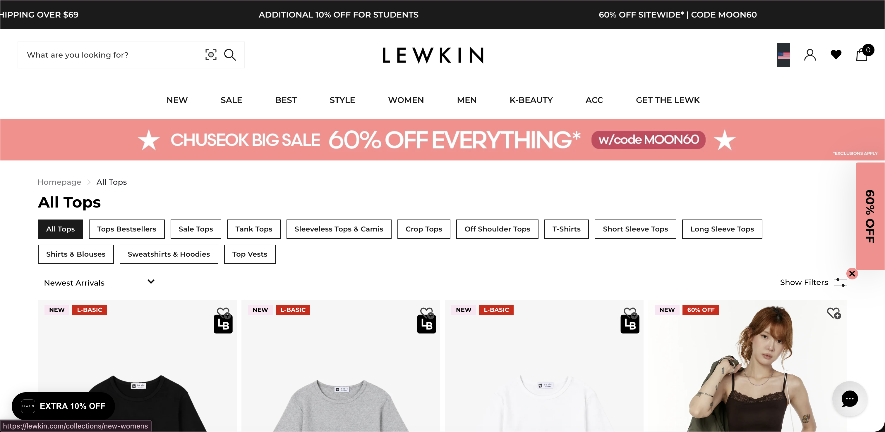

## Concepts used

- General
    - Links
    - Positioning
    - CSS variables
    - Classes
    - Input
- Navbar
    - Grid
- Product cards
    - Flexbox
- Text
    - Importing fonts

## Concepts to learn
- Random variables (for random color picking)
- Popups
- In-page/jump links?

## Wireframe & Sitemap

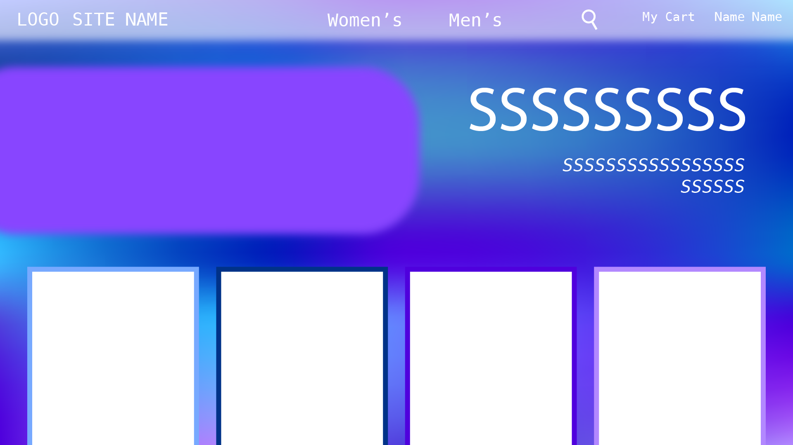
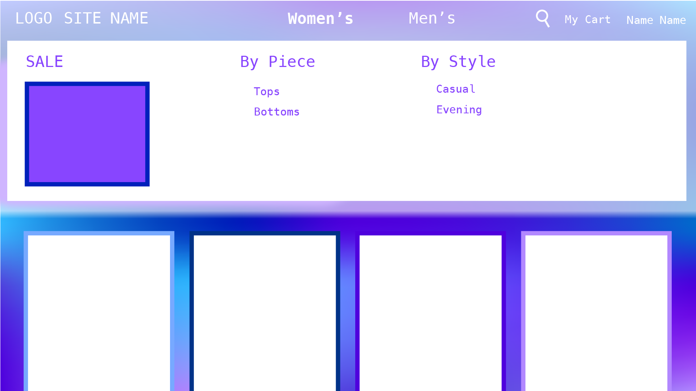

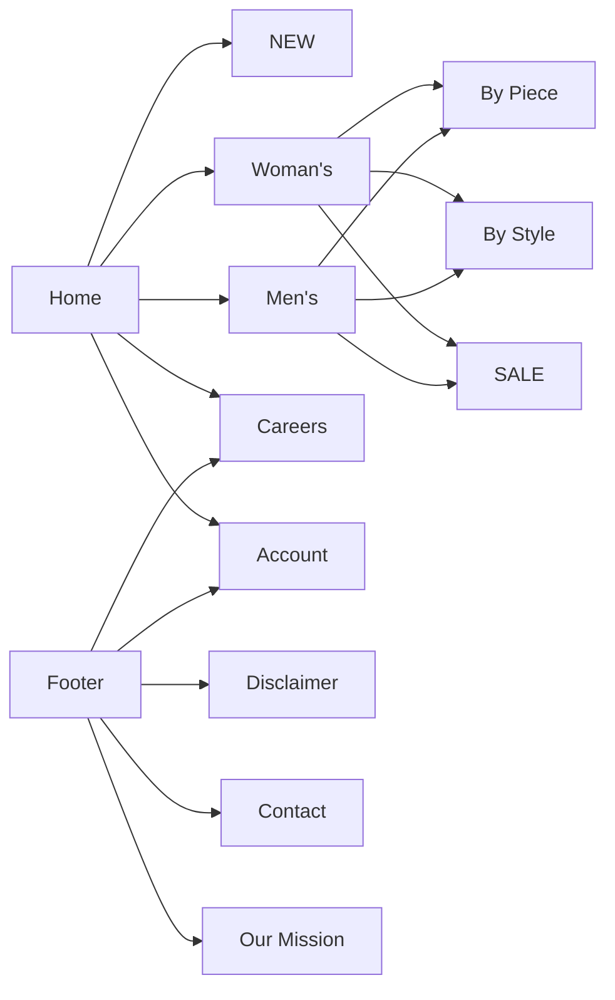
